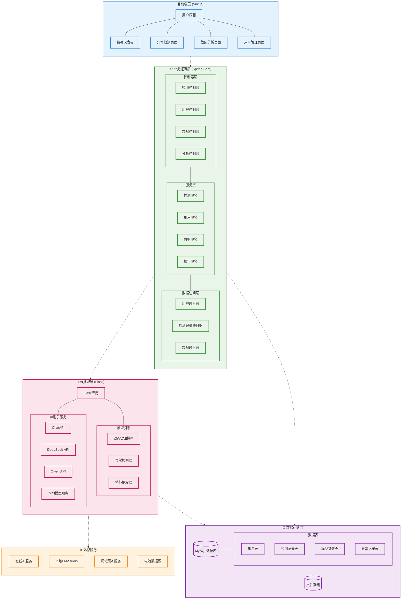
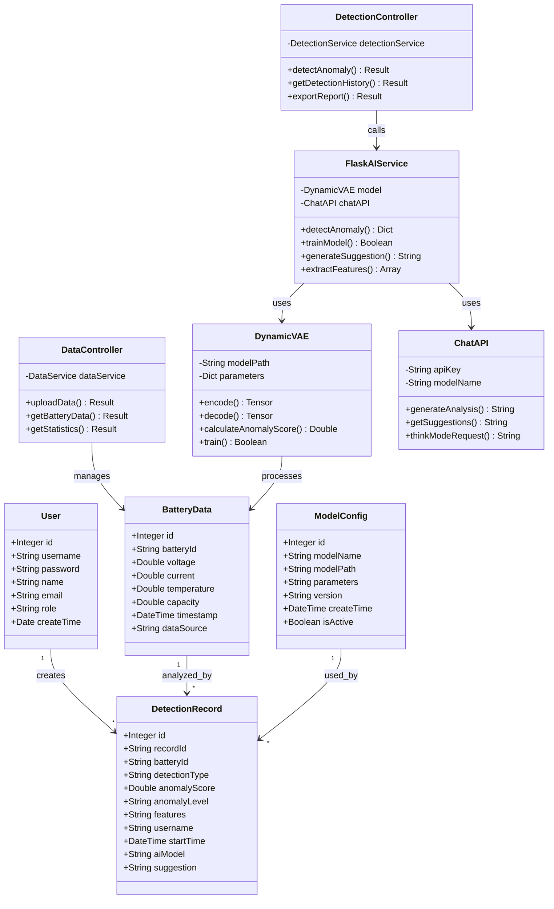
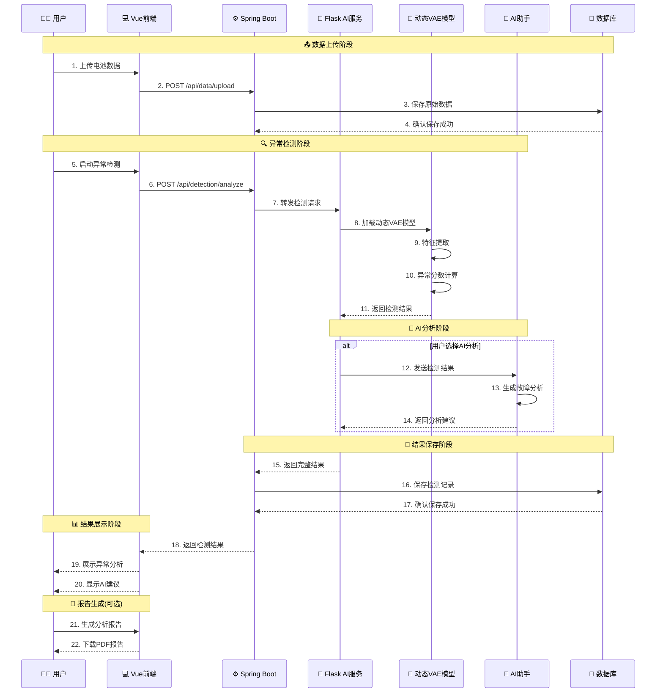
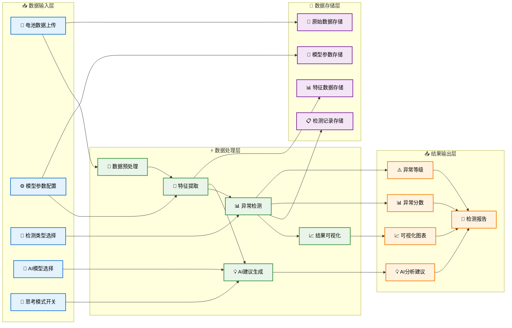
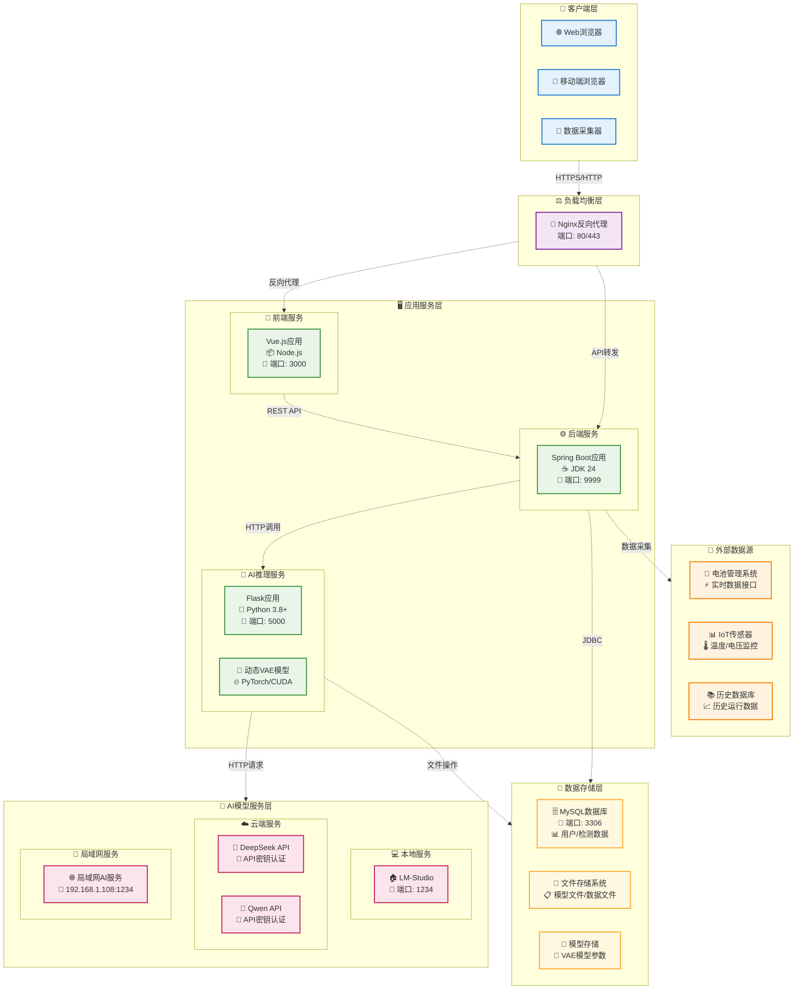

# 基于动态深度学习与大模型反馈的电池故障检测系统

本项目是一个基于动态深度学习与大模型反馈的电池故障检测系统，能够实时检测电池运行状态，预测潜在故障，并提供智能分析与建议。系统集成了前端展示、后端处理和深度学习模型，为电池健康管理提供全面解决方案。

## 🏗️ 系统架构

### 📋 架构概览



---

## 🗄️ 数据模型设计

### 📊 实体关系图



---

## 🔄 系统流程设计

### ⏱️ 异常检测流程时序图



### 📊 数据流图



---

## 🚀 部署架构

### 🖥️ 部署架构图



---

本系统采用前后端分离架构，包含三个主要组件：

1. **前端(Vue)**：基于Vue3+TypeScript构建的用户界面，提供直观的数据可视化和分析工具。
2. **后端(SpringBoot)**：负责用户管理、数据存储和请求转发的Java服务。
3. **AI模型服务(Flask)**：运行动态深度学习模型和大语言模型的Python服务，提供异常检测和智能分析功能。

## 主要功能

- 时间点异常检测：实时监测电池参数，检测单一时间点的异常
- 时间段异常检测：分析电池历史数据，识别长期异常模式
- 故障预警与分析：通过动态VAE模型检测异常并计算异常分数
- 智能分析报告：生成可视化报表，并提供LLM分析建议
- 用户管理：多用户权限管理

## 技术栈

- **前端**：Vue 3、TypeScript、Element Plus
- **后端**：SpringBoot 3.5.4 (最新版)、MyBatis-Plus、MySQL
- **AI服务**：Flask、动态VAE模型、大型语言模型API
- **Java版本**：JDK 24 (最新LTS版本)
- **部署**：Docker (可选)

## 🚀 最新更新

### 版本升级 (2025年8月)
- **JDK升级**：从Java 1.8 升级到 JDK 24，带来以下改进：
  - 更好的垃圾回收性能
  - 增强的安全特性
  - 改进的JVM性能和内存管理
- **Spring Boot升级**：从2.3.7升级到3.5.4
  - 支持更多现代化特性
  - 更好的性能和稳定性
  - 增强的安全性
- **依赖库更新**：升级了所有核心依赖到最新稳定版本
- **警告修复**：解决了JDK 24下的所有编译和运行时警告
  - 添加了`--sun-misc-unsafe-memory-access=allow`参数解决FastJSON2的sun.misc.Unsafe警告
  - 升级FastJSON2到2.0.58版本（最新稳定版）
  - 配置了完整的JVM参数确保在JDK 24下正常运行

## 快速开始

### 前提条件

- **JDK 24** (已升级到最新版本，包含性能优化和安全改进)
- Node.js 16+
- Python 3.8+
- MySQL 8.0+
- CUDA支持的GPU (推荐用于模型推理)
- LM-Studio (用于本地部署大模型)

### JDK 24 兼容性说明

本项目已完全适配JDK 24，所有JVM警告均已解决：

- ✅ **sun.misc.Unsafe警告** - 通过`--sun-misc-unsafe-memory-access=allow`参数解决
- ✅ **模块系统** - 配置了必要的`--add-opens`参数
- ✅ **动态代理** - 启用了`-XX:+EnableDynamicAgentLoading`
- ✅ **参数名保留** - 编译器配置了`-parameters`标志

如需手动运行，请使用以下JVM参数：
```bash
--enable-native-access=ALL-UNNAMED
--add-opens java.base/java.lang=ALL-UNNAMED 
--add-opens java.base/java.util=ALL-UNNAMED
--add-opens java.base/sun.misc=ALL-UNNAMED
--sun-misc-unsafe-memory-access=allow
-XX:+EnableDynamicAgentLoading
```

### 数据库配置

1. 创建名为`ai`的数据库
2. 运行`数据库文件/database.sql`脚本初始化数据库结构

### 后端服务启动

1. 进入springboot目录
2. 使用Maven构建项目：`mvn clean package`
3. 运行生成的jar文件：`java -jar target/Kcsj-0.0.1-SNAPSHOT.jar`

### AI服务启动

1. 进入flask目录
2. 安装依赖：`pip install -r requirements.txt`
3. 启动Flask服务：`python main.py`

### 前端启动

1. 进入vue目录
2. 安装依赖：`npm install`
3. 启动开发服务器：`npm run dev`
4. 构建生产版本：`npm run build`

## 系统访问

- 前端页面：http://localhost:3000
- Spring Boot 后端：http://localhost:9999
- Flask AI 服务：http://localhost:5000

### 默认登录账号

- **管理员账号**：admin
- **密码**：admin123

## 大模型部署与使用

本系统支持多种大模型部署方式，用于生成故障分析报告和建议：

### 支持的模型

- **云端API模型**
  - Deepseek-R1
  - Qwen

- **局域网部署模型**
  - Deepseek-R1-LAN
  - Qwen3-LAN
  - Qwen2.5-VL-LAN
  - Qwen2.5-Omni-LAN
  - Gemma3-LAN

- **本地部署模型**
  - Deepseek-R1-Local
  - Qwen3-Local
  - Qwen2.5-VL-Local
  - Qwen2.5-Omni-Local
  - Gemma3-Local

### 使用LM-Studio进行本地部署

1. 下载并安装 [LM-Studio](https://lmstudio.ai/)
2. 从Hugging Face或其他来源下载所需模型（如Deepseek-R1、Qwen等）
3. 在LM-Studio中加载模型
4. 启动本地API服务器（通常在http://localhost:1234）
5. 在系统设置中选择对应的"本地"模型选项

### 思考模式

系统支持开启思考模式（thinkMode），启用后大模型会提供更详细的分析过程和故障诊断依据，适合研究和深度分析使用。

## 模型信息

### 动态深度学习模型

本系统使用的动态深度学习模型基于清华大学提出的Dyad（Dynamic Anomaly Detection）框架，该框架专为电池故障检测设计，能够捕捉电池参数的时序变化特征。模型采用变分自编码器（VAE）结构，通过学习正常电池运行状态的分布，识别偏离正常范围的异常模式。

### 大语言模型

支持多种大语言模型，既可以通过API密钥访问云端模型，也可以通过LM-Studio在本地部署运行。系统会根据选定的模型自动配置请求参数。

## 许可证

MIT

## 贡献

欢迎提交问题和贡献代码，请通过创建Issue或Pull Request参与项目开发。

## 致谢

感谢清华大学提供的Dyad动态深度学习模型框架，以及所有为本项目提供支持和贡献的人员。
